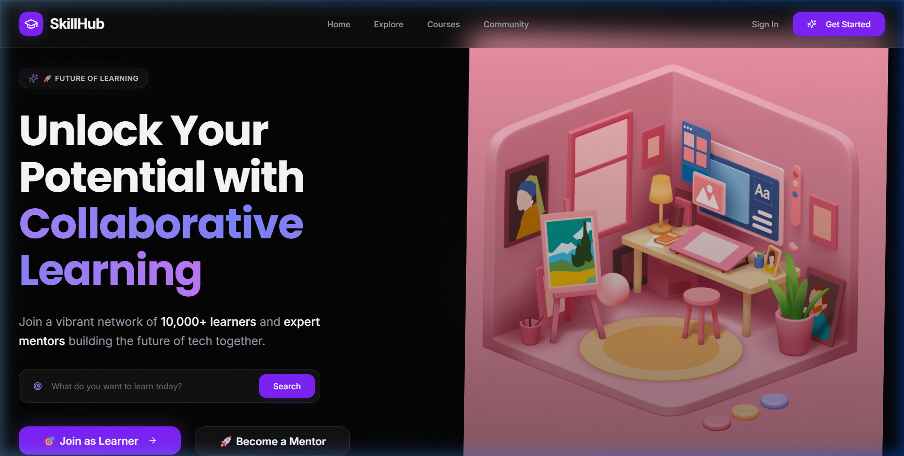
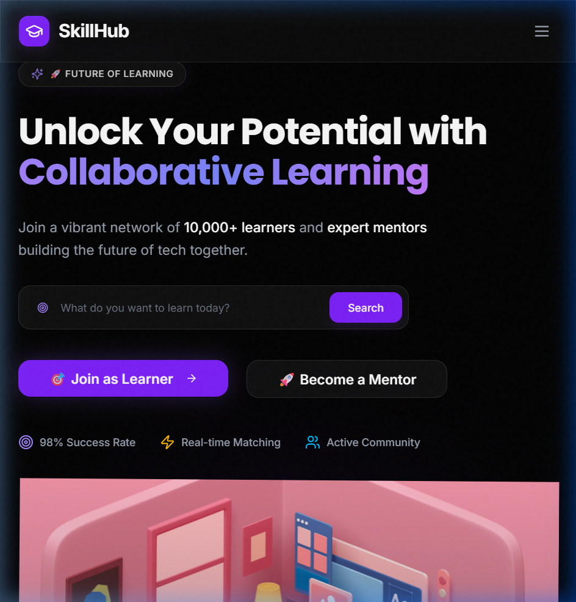

# 🚀 SkillHub: Collaborative Learning & Mentorship Platform

SkillHub is a premium, community-driven platform designed to bridge the gap between learners and experts. Built with a cutting-edge tech stack and an immersive 3D user experience, it empowers users to connect, learn, and grow through certified courses and direct mentorship.

---

## 🌐 Live Deployment
**Production URL**: [https://skill-hub-frontend-alpha.vercel.app/](https://skill-hub-frontend-alpha.vercel.app/)

---

## ✨ Immersive Visuals

### 🖥 Desktop View


### 📱 Responsive Design (Tablet & Mobile)
<p align="center">
  
  
</p>

---

## 🛠 Advanced Tech Stack

| Layer | Technologies |
| :--- | :--- |
| **Frontend** | Next.js 16 (App Router), React 19, Tailwind CSS 4, Framer Motion |
| **3D & Graphics** | Three.js, React Three Fiber, Spline Runtime |
| **Backend** | Express.js 5, TypeScript, Node.js |
| **Database/Auth** | Supabase (PostgreSQL), Supabase SSR |
| **State/Data** | TanStack Query, Zod, Radix UI |

---

## 💎 Key Features

- **🔐 Robust Authentication**: Secure login and session persistence via Supabase and Google OAuth.
- **🧑‍🎓 Specialized Onboarding**: Tailored registration flows for both Learners and Mentors.
- **📚 Dynamic Course Marketplace**: Explore, filter, and enroll in certified courses.
- **🎨 Premium UI/UX**: A sleek, violet-themed glassmorphism design with immersive 3D Hero elements.
- **📱 Universal Responsiveness**: Pixel-perfect experience across Mobile, Tablet, and Desktop.
- **⚡ Performance First**: Optimized build using Next.js Turbopack for lightning-fast loads.

---

## 📁 Project Structure

```bash
Skill-Hub/
├── frontend/           # Next.js Application (UI & Client Logic)
├── backend/            # Express Server (API & Database Services)
├── supabase/           # Database Schemas & Migrations
├── docs/               # Project Documentation & Screenshots
└── package.json        # Workspace Configuration
```

---

## 🧑‍💻 Getting Started

### Prerequisites
- **Node.js**: v20 or higher
- **npm**: v10 or higher

### Setup & Run
1. **Clone the Repo**
   ```bash
   git clone https://github.com/Whitedevil2004r27/Skill-Hub.git
   cd Skill-Hub
   ```

2. **Install Dependencies**
   ```bash
   npm install
   ```

3. **Run in Production Mode**
   ```bash
   npm run build
   npm start
   ```

4. **Run in Development Mode**
   ```bash
   npm run dev
   ```

---

## 🤝 Connect With Me

**Ravikumar J**
- **GitHub**: [@Whitedevil2004r27](https://github.com/Whitedevil2004r27)
- **LinkedIn**: [Ravikumar J](https://www.linkedin.com/in/rk-portfolio/)
- **Email**: [ravikumar2004rkk27@gmail.com](mailto:ravikumar2004rkk27@gmail.com)

---

Built with 💜 to empower the next generation of developers.
